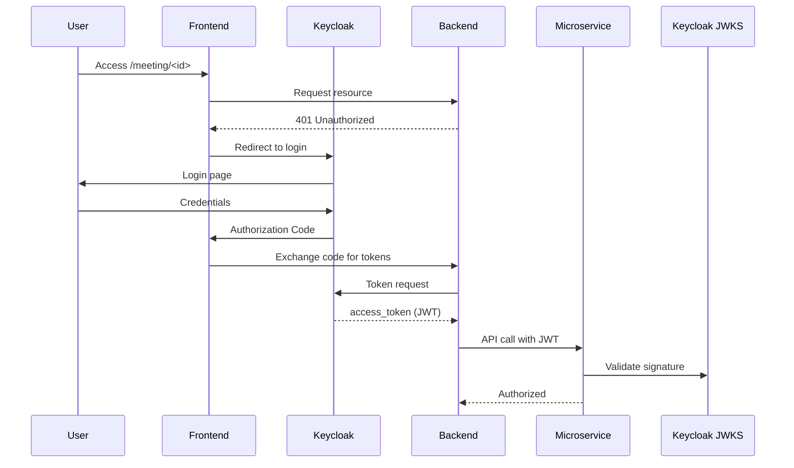
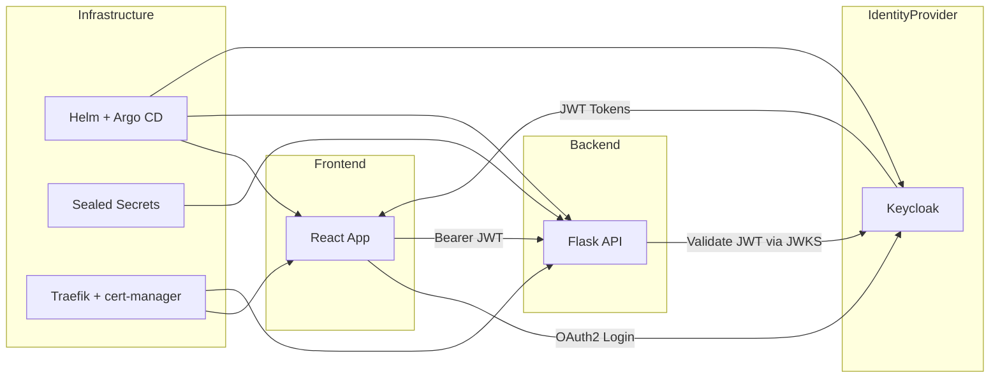

# General project plan with security (sort of)


# Keycloak Integration with React & Flask

## Overview
This demo application demonstrates a secure integration between Keycloak, a React frontend, and a Flask backend using OAuth2/OpenID Connect and JWT tokens. It is designed as a template for modern microservice architectures with best security practices.

---

## Architecture
```
React Frontend  <--->  Keycloak (IdP)  <--->  Flask Backend
       |                                   |
       |----> JWT (Bearer Token) ---------|
```

### Components
- **React Frontend**: Handles login via Keycloak and displays JWT claims.
- **Flask Backend**: Validates JWT tokens and provides secure endpoints.
- **Keycloak**: Issues signed JWT tokens containing user identity and roles.
- **Helm Chart**: Deploys frontend and backend with TLS-enabled ingress.
- **GitHub Actions CI/CD**: Builds Docker images, pushes to GHCR, updates Helm values.
- **Argo CD**: Syncs Helm chart for GitOps deployment.

---

## JWT Flow Explained
### 1. User Login (React → Keycloak)
React uses the Keycloak JavaScript adapter:
```javascript
import Keycloak from 'keycloak-js';
const keycloak = new Keycloak({
  url: 'https://<keycloak-domain>/',
  realm: 'meeting-realm',
  clientId: 'react-client'
});
keycloak.init({ onLoad: 'login-required' }).then(auth => {
  console.log('JWT Token:', keycloak.token);
});
```
After login, Keycloak returns an **access token (JWT)** and optionally a refresh token.

### 2. Frontend → Backend (Bearer Token)
React sends the JWT in the `Authorization` header:
```javascript
fetch('/api/secure', {
  headers: { Authorization: `Bearer ${keycloak.token}` }
});
```

### 3. Backend Validation (Flask)
Flask validates the JWT using Keycloak's JWKS public keys:
```python
import jwt, requests
from flask import Flask, request, jsonify

app = Flask(__name__)
JWKS_URL = 'https://<keycloak-domain>/realms/meeting-realm/protocol/openid-connect/certs'
jwks = requests.get(JWKS_URL).json()

def get_public_key(kid):
    for key in jwks['keys']:
        if key['kid'] == kid:
            return jwt.algorithms.RSAAlgorithm.from_jwk(key)
    return None

@app.route('/secure')
def secure():
    auth_header = request.headers.get('Authorization')
    if not auth_header:
        return jsonify({'error': 'Missing token'}), 401
    token = auth_header.split(' ')[1]
    header = jwt.get_unverified_header(token)
    public_key = get_public_key(header['kid'])
    try:
        decoded = jwt.decode(token, public_key, algorithms=['RS256'], audience='flask-client')
        return jsonify({'message': 'Access granted', 'claims': decoded})
    except jwt.InvalidTokenError:
        return jsonify({'error': 'Invalid token'}), 401
```

### 4. Dynamic Role Assignment (Optional)
Use Keycloak Admin API to assign roles dynamically:
```python
import requests
ADMIN_TOKEN = '<admin-token>'
url = 'https://<keycloak-domain>/admin/realms/meeting-realm/users/<user-id>/role-mappings/realm'
role_payload = [{"id": "<role-id>", "name": "meeting-123-participant"}]
requests.post(url, headers={'Authorization': f'Bearer {ADMIN_TOKEN}'}, json=role_payload)
```

---

## Security Best Practices
- Validate JWT signature and claims (`exp`, `iss`, `aud`).
- Use short-lived access tokens and refresh tokens.
- Never expose Keycloak private keys; backend uses JWKS public keys.
- Store client secrets securely using Sealed Secrets.
- Enable TLS for all ingress traffic.

---

## Deployment Steps
1. Push this repo to GitHub.
2. Configure Argo CD application pointing to `helm-chart`.
3. Update `values.yaml` with your domain and GHCR image paths.
4. GitHub Actions builds and pushes images, updates Helm values.
5. Argo CD syncs automatically.

---

## Experimentation
- Login via React frontend.
- Inspect JWT claims.
- Call Flask backend `/secure` endpoint.
- Extend `/assign-role` for dynamic permissions.

---

## Industry Standard Compliance
- OAuth2/OpenID Connect for authentication.
- JWT-based stateless authorization.
- GitOps deployment with Argo CD.
- Secure secrets via Sealed Secrets.
- TLS encryption via cert-manager.


## Advanced Keycloak Tips & Security Mastery

### ✅ Keycloak Configuration Best Practices
- **Realms**: Use separate realms for different environments (dev, staging, prod).
- **Clients**:
  - Use `public` clients for frontends with PKCE enabled.
  - Use `confidential` clients for backends with client secrets stored securely.
- **Roles & Groups**:
  - Define realm roles for global permissions.
  - Use groups for hierarchical permissions and easier management.
- **Authorization Services**:
  - Enable fine-grained policies for resource-based access control.
  - Use Keycloak's Policy Decision Point (PDP) for dynamic permissions.
- **Token Lifetimes**:
  - Short-lived access tokens (5–15 min).
  - Refresh tokens for session longevity.
- **JWKS Caching**:
  - Cache JWKS keys in backend to avoid frequent calls to Keycloak.

### ✅ Frontend Security Best Practices
- **OAuth2 Flow**:
  - Always use Authorization Code Flow with PKCE.
- **Silent Refresh**:
  - Implement token refresh without user interaction.
- **Token Storage**:
  - Store tokens in memory or secure HTTP-only cookies.
  - Avoid localStorage/sessionStorage for sensitive tokens.

### ✅ Backend Security Best Practices
- **JWT Validation**:
  - Validate signature using JWKS.
  - Check `exp`, `iss`, `aud` claims.
- **JWKS Caching**:
  - Cache keys for performance.
- **Token Introspection**:
  - For critical operations, call Keycloak introspection endpoint.
- **Role-Based Access Control**:
  - Enforce roles from `realm_access.roles` claim.
- **Dynamic Permissions**:
  - Use Keycloak Admin API for assigning roles dynamically.

### ✅ Industry Standards
- **TLS Everywhere**: Use HTTPS for all services.
- **mTLS for Service-to-Service**: Mutual TLS for backend microservices.
- **Refresh Token Rotation**: Rotate refresh tokens to prevent replay attacks.
- **Audit Logging**: Enable Keycloak audit logs for compliance.

### ✅ Implementation Details
#### Frontend:
- Initialize Keycloak with `keycloak-js`.
- Configure PKCE and silent refresh.
- Display JWT claims for debugging.

#### Backend:
- Fetch JWKS from Keycloak and cache.
- Validate JWT using PyJWT.
- Implement `/assign-role` endpoint using Keycloak Admin API.

#### Helm & GitOps:
- Use Sealed Secrets for client credentials.
- Configure Ingress with TLS and cert-manager.
- Automate deployments with Argo CD.


## Architecture Diagram (Mermaid)


## Quick Start with Docker Compose
Create a `docker-compose.yml` for local testing:
```yaml
version: '3.8'
services:
  frontend:
    build: ./frontend
    ports:
      - '3000:3000'
  backend:
    build: ./backend
    ports:
      - '5000:5000'
```
Run locally:
```bash
docker-compose up --build
```

## Dynamic Role Assignment
- Use Keycloak Admin API to create roles and assign them dynamically:
  - Endpoint: `/admin/realms/{realm}/users/{id}/role-mappings/realm`
  - Backend can call this using `KEYCLOAK_CLIENT_SECRET` from Sealed Secret.

## Additional Security Hardening
- Enable HTTPS everywhere (TLS ingress configured).
- Use short-lived tokens and refresh tokens.
- Validate `aud`, `iss`, `exp` claims strictly.
- Consider enabling Keycloak Authorization Services for fine-grained policies.
- Use mTLS for service-to-service communication in production.